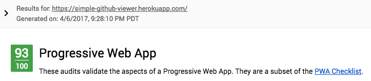

# GitHub Viewer

A simple [Progressive Web Application](https://developers.google.com/web/progressive-web-apps/) that allows you to view the repositories for GitHub organizations and explore the commit history of those repositories.

## Architecture / Considerations

This app was intended to be developed quickly and thus Ember.js and its eco-system are leveraged heavily. The opinionated nature and shared tooling of Ember-CLI allowed many features to be added quickly.

## Prerequisites

You will need the following things properly installed on your computer.

* [Git](https://git-scm.com/)
* [Node.js](https://nodejs.org/) (with [Yarn](https://yarnpkg.com/en/))
* [Ember CLI](https://ember-cli.com/)

## Installation

* `git clone https://github.com/trentmwillis/gh-viewer.git` this repository
* `cd gh-viewer`
* `yarn install`

## Running / Development

* `ember serve`
* Visit the application at [http://localhost:4200](http://localhost:4200).

### Running Tests

* `ember test`

### Deployments

Deployments automatically happen once changes have been merged into master. So, make sure you test your changes!
